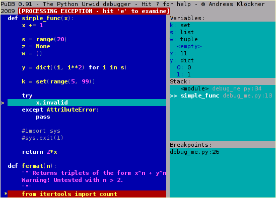

# Trucs de debugging pour python (et django)

---

# Étape 0

Utiliser pdb.

Qui ne connait pas pdb ?

---

# Étape 1

- arrêtez d'utiliser pdb
- passez à ipdb

Comme pdb (mais tout en mieux):

    !python
    from ipdb import set_trace
    set_trace()

Installation:

    pip install ipdb

[https://github.com/gotcha/ipdb](https://github.com/gotcha/ipdb)

---

# Étape 2

Être paresseux.

    pip install debug

    import debug

Moins à retenir ! Import aussi "see".

Remarque: vous connaissez pprint ?

[https://github.com/narfdotpl/debug](https://github.com/narfdotpl/debug)

---

# Étape 3

Être tout aussi paresseux:

    ipython --pdb script.py

ipython --pdb script.py

Lance (i)pdb si le script rate.

(Qui ne connait pas ipython ?)

[http://ipython.org/](http://ipython.org/)

---

# Étape 4

Mieux vaut prévenir que guerrir:

    !python
    from ipdb import launch_ipdb_on_exception
    with launch_ipdb_on_exception():
        ...

---

# Étape 5

L'arme de destruction massive:

    !python
    from IPython import embed; embed()

ATTENTON: ce n'est pas un debugger ! (démo)

---

# Détails

Ipython a une fonction magique "%run".

    %run -d script.py

    %run -t script.py

Insère dans le contexte de ipython.

***Lire le %quickref de ipython !!***

---

# Django

---

# Django-Debug-Toolbar

- indispensable !
- requètes sql
- templates + context
- timing
- et bien plus

Attention: intrusif !

Démo.

[https://github.com/django-debug-toolbar/django-debug-toolbar](https://github.com/django-debug-toolbar/django-debug-toolbar)

---

# django-extensions

    pip install django-extensions
    pip install werkzeug

Ajouter 'django\_extensions' aux INSTALLED\_APPS.

    python manage.py runserver_plus

Vous donne un ***shell de debug dans vos pages d'erreurs 500*** ! (Le même que dans Flask).

Et aussi:

    python manage.py shell_plus

Il y a plus de trucs cool mais je connais pas trop.

[https://github.com/django-extensions/django-extensions](https://github.com/django-extensions/django-extensions)

---

# django-pdb

    pip install django-pdb

'django\_pdb' dans vos INSTALLED\_APPS et 'django\_pdb.middleware.PdbMiddleware' à la ***fin*** de vos middleware.

    
    {{ variable.truc.bidule|ipdb }}
    {{ variable.truc.bidule|ipdb|un_filtre_a_debugger }}

Ou:

    http://localhost:8000/ma_super_url?ipdb

Ou:

    python manage.py runserver --ipdb
    python manage.py runserver --pm
    python manage.py test --ipdb

(Marche avec pdb aussi, mais on s'en fou)

[https://github.com/tomchristie/django-pdb](https://github.com/tomchristie/django-pdb)

---

# Bonus

[https://github.com/dcramer/django-devserver](https://github.com/dcramer/django-devserver) runserver de Django on steroïd. Peut testé, a l'air d'avoir beaucoup évolué depuis la dernière fois que j'ai regardé. Démo ?

[https://github.com/dcramer/pdbinject](https://github.com/dcramer/pdbinject) Marche mais trop réussit à m'en servir de manière intéressante.

[https://pypi.python.org/pypi/pudb](https://pypi.python.org/pypi/pudb) Existe.

---

# Conclusion

- oubliez pdb, utilisez ipdb
- pip install debug; import debug
- ipython --pdb script.py
- python manage.py runserver_plus

---

# Questions / vos trucs ?
